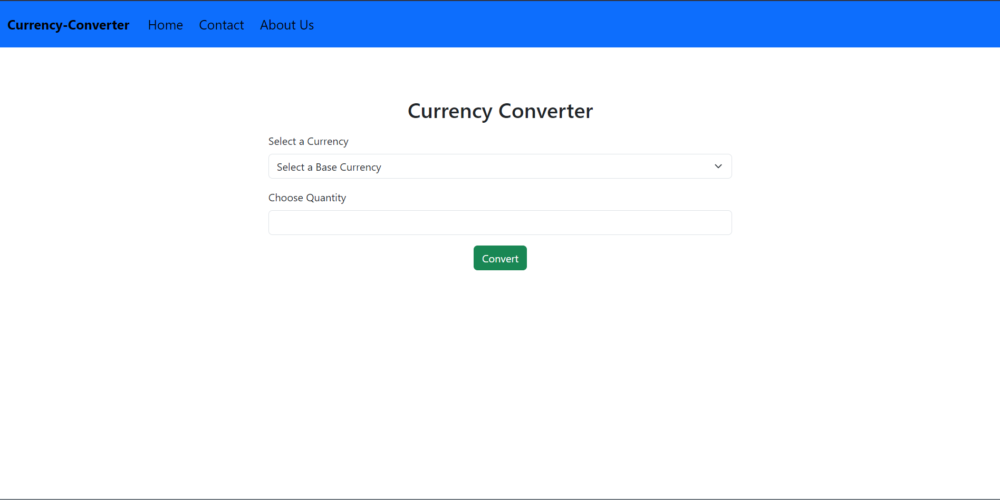
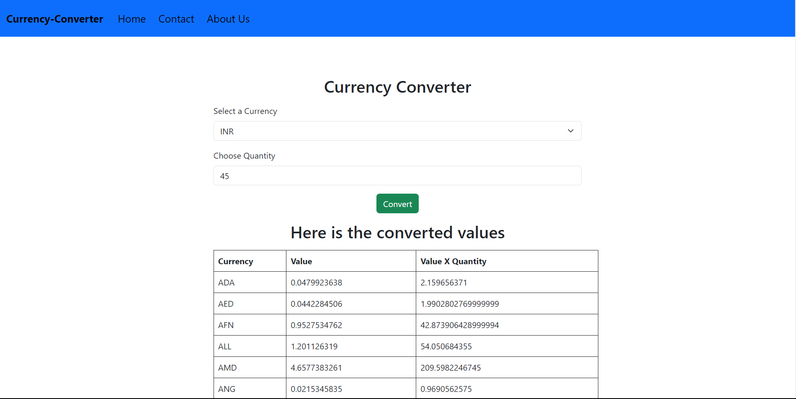

# Currency Converter Web Application

Welcome to the Currency Converter web application! Easily convert currencies with this simple, user-friendly tool.

## Features

- **Currency Conversion**: Input base currency and quantity to get conversion rates.
- **Real-Time Data**: Access up-to-date exchange rates from reliable sources.
- **User-Friendly Interface**: Intuitive design for seamless currency conversion.
- **Responsive**: Works smoothly on desktop and mobile devices.

## Screenshots

## How to Use

1. Clone this repository to your local machine.
2. Open `index.html` in your preferred web browser.
3. Enter the base currency and quantity.
4. Instantly view the converted currency values in the table.

## Technologies Used

- HTML
- CSS
- JavaScript

## Credits

- Currency exchange rate data provided by Currency api.

---

Enjoy seamless currency conversion with our Currency Converter web application! If you have any questions or suggestions, feel free to [contact us](insert-contact-info-here).
